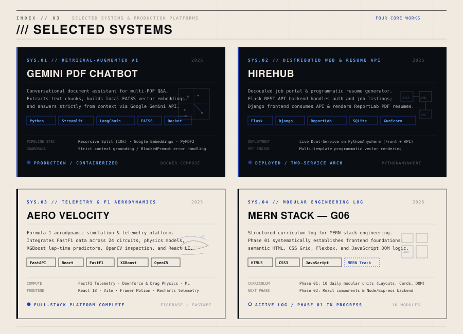
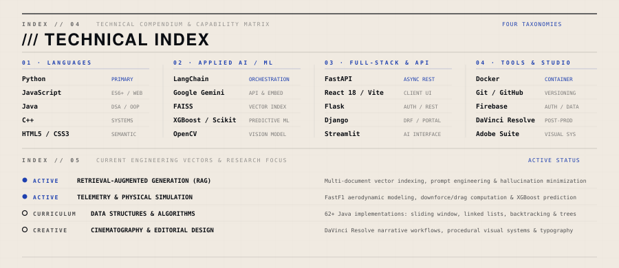
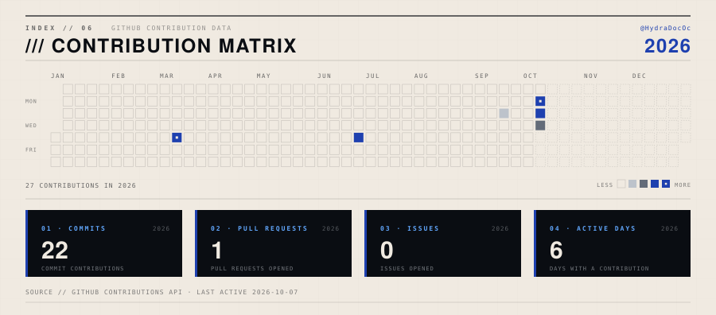

<!--
  HYDRA // DIGITAL LAB
  GitHub Profile — HydraDocOc
  Designed by: Dhawal Goyal
  Version: 1.0.0
  System: Neo-Futurist Editorial
-->

---

 

<code>INDEX // 03.B</code>&nbsp;&nbsp;·&nbsp;&nbsp;<b>VERIFIED ARCHITECTURAL SPECIFICATIONS</b>&nbsp;&nbsp;·&nbsp;&nbsp;<code>HDL-LEDGER-2026</code>

 

<table>
<thead>
<tr>
<th align="left" width="28%">SYSTEM / REPOSITORY</th>
<th align="left" width="72%">VERIFIED ARCHITECTURE &amp; DELIVERABLES</th>
</tr>
</thead>
<tbody>
<tr>
<td valign="top">

`01` **GEMINI PDF CHATBOT** 
AI / RAG DOCUMENT ASSISTANT  
📂 [**View Repository**](https://github.com/HydraDocOc/gemini-pdf-chatbot) 
<code>github.com/.../gemini-pdf-chatbot</code>

</td>
<td valign="top">

* **Actual Purpose:** Streamlit-powered conversational document assistant enabling natural-language question answering strictly grounded in one or multiple uploaded PDF files.
* **Actual Technology Stack:** Python 3.10+, Streamlit, LangChain (`langchain`, `langchain-community`, `langchain-google-genai`), Google Gemini API (`gemini-pro`, `models/embedding-001`), FAISS (`faiss-cpu`), PyPDF2, python-dotenv, Docker (`compose.yaml`).
* **Actual Repository URL:** `https://github.com/HydraDocOc/gemini-pdf-chatbot`
* **Current State:** Fully completed, functional, and containerized with Docker &amp; Docker Compose; features safety filter exception handling (`BlockedPromptException`) and chat session state management.
* **Strongest Feature:** Grounded multi-PDF RAG pipeline utilizing recursive character text chunking, Google Gemini embeddings, and local FAISS vector search with strict context prompts that prevent hallucination.

</td>
</tr>
<tr>
<td valign="top">

`02` **HIREHUB** 
JOB PORTAL + RESUME BUILDER  
📂 [**View Repository**](https://github.com/HydraDocOc/HireHub-With-Resume-Builder-using-API) 
🌐 [**Live Frontend**](https://sanchal.pythonanywhere.com) 
🔌 [**Live API Backend**](https://dhawalgoyal.pythonanywhere.com/api/job/1)

</td>
<td valign="top">

* **Actual Purpose:** Modular web application connecting job seekers and employers with job search, applications, employer job postings, and an integrated multi-template PDF resume builder.
* **Actual Technology Stack:** Python, Flask 3.0.3 (REST API backend with Flask-SQLAlchemy, Flask-Login, Flask-Bcrypt, Flask-Cors, Flask-Migrate), Django 5.2 (frontend web app with Django REST Framework, django-crispy-forms, crispy-bootstrap5, django-tailwind), ReportLab 4.3.1 (PDF engine), SQLite / PostgreSQL, Gunicorn, WhiteNoise.
* **Actual Repository URL:** `https://github.com/HydraDocOc/HireHub-With-Resume-Builder-using-API`
* **Current State:** Deployed and functional dual-service application hosted on PythonAnywhere with live frontend and RESTful endpoints.
* **Strongest Feature:** Decoupled microservice architecture consuming Flask REST APIs from a Django frontend, coupled with programmatic multi-template PDF resume generation via ReportLab.

</td>
</tr>
<tr>
<td valign="top">

`03` **AERO VELOCITY** 
F1 AERODYNAMICS PLATFORM  
📂 [**View Repository**](https://github.com/HydraDocOc/Aero-Velocity) 
<code>github.com/.../Aero-Velocity</code>

</td>
<td valign="top">

* **Actual Purpose:** Formula 1 aerodynamics analysis platform combining real-time telemetry across all 24 circuits of the 2025 season, physics-based aerodynamic calculations, machine learning lap-time predictions, and computer vision component inspection.
* **Actual Technology Stack:** React 18.2.0, Vite 4.4.5, React Router DOM, Framer Motion, Recharts, Lucide React, Firebase, Google Generative AI (`@google/genai`), FastAPI 0.104.0, Uvicorn, Pydantic, FastF1 API (3.0.0+), Scikit-learn, XGBoost, LightGBM, TensorFlow/Keras, OpenCV 4.8.0+, Pillow, Scikit-image, Plotly.
* **Actual Repository URL:** `https://github.com/HydraDocOc/Aero-Velocity`
* **Current State:** Feature-complete full-stack platform with integrated ML pipelines, FastAPI endpoints, Vite/React UI, Firebase authentication, and interactive telemetry charts.
* **Strongest Feature:** End-to-end telemetry and aerodynamic analysis marrying official FastF1 circuit telemetry with XGBoost ML lap-time predictions, physics calculations, and OpenCV visual component analysis.

</td>
</tr>
<tr>
<td valign="top">

`04` **MERN STACK — G06** 
DAILY ENGINEERING LOG  
📂 [**View Repository**](https://github.com/HydraDocOc/MERN_STACK_G06) 
<code>github.com/.../MERN_STACK_G06</code>

</td>
<td valign="top">

* **Actual Purpose:** Structured, modular daily learning log tracking full-stack MERN development coursework, starting with Phase 01 covering responsive UI components, semantic HTML, modern CSS layouts (CSS Grid, Flexbox), and JavaScript DOM manipulation.
* **Actual Technology Stack:** HTML5, CSS3 (CSS Grid, Flexbox, media queries), Vanilla JavaScript (foundation track for MongoDB, Express, React, Node.js).
* **Actual Repository URL:** `https://github.com/HydraDocOc/MERN_STACK_G06`
* **Current State:** Active learning log in progress; Phase 01 initiated with daily module tasks (e.g., responsive bike blog card grids and flex layouts).
* **Strongest Feature:** Structured daily engineering log demonstrating strong UI fundamentals in modern CSS Grid, Flexbox, and responsive card layouts before scaling into full MERN backends.

</td>
</tr>
</tbody>
</table>

 

<b><code>///</code> ADDITIONAL REPOSITORY ARCHIVES &amp; COURSEWORK (CLICK TO EXPAND)</b>

 

<table>
<thead>
<tr>
<th align="left" width="26%">Repository</th>
<th align="left" width="74%">Verified Purpose &amp; Implementation Details</th>
</tr>
</thead>
<tbody>
<tr>
<td valign="top">

`05` **PA-CLASS** 
ALGORITHMS &amp; DATA STRUCTURES  
📂 [**View Repository**](https://github.com/HydraDocOc/PA-Class)

</td>
<td valign="top">

* **Actual Purpose:** University coursework repository covering core Data Structures &amp; Algorithms (DSA), Object-Oriented Programming, and competitive programming problem solving in Java.
* **Actual Technology Stack:** Java (Java SE).
* **Actual Repository URL:** `https://github.com/HydraDocOc/PA-Class`
* **Current State:** Active (62+ LeetCode problems and DSA implementations across 10 structured weekly modules).
* **Strongest Feature:** Extensive curriculum of 62+ algorithm solutions covering Sliding Window, Two Pointers, Binary Search, Sorting, Recursion, Backtracking (N-Queens), and Singly/Doubly/Circular Linked Lists.

</td>
</tr>
<tr>
<td valign="top">

`06` **RECIPE SHARING PLATFORM** 
<code>FEE-Project</code> / <code>Project-Deployment</code>  
📂 [**View FEE-Project**](https://github.com/HydraDocOc/FEE-Project) 
📂 [**View Project-Deployment**](https://github.com/HydraDocOc/Project-Deployment)

</td>
<td valign="top">

* **Actual Purpose:** Front End Engineering (FEE) course project — an interactive recipe sharing website featuring user recipes, chef highlights, login, and submission workflows.
* **Actual Technology Stack:** HTML5, CSS3, JavaScript.
* **Actual Repository URL:** `https://github.com/HydraDocOc/FEE-Project` &amp; `https://github.com/HydraDocOc/Project-Deployment`
* **Current State:** Completed academic project including project report, presentation, and standalone deployment files.
* **Strongest Feature:** Multi-page responsive web layout with dedicated recipe catalog and submission modules.

</td>
</tr>
</tbody>
</table>

---

---

---

---

<code>HYDRA // DIGITAL LAB</code>&nbsp;&nbsp;·&nbsp;&nbsp;<a href="https://github.com/HydraDocOc">github.com/HydraDocOc</a>&nbsp;&nbsp;·&nbsp;&nbsp;<code>INDIA / 2026</code>

