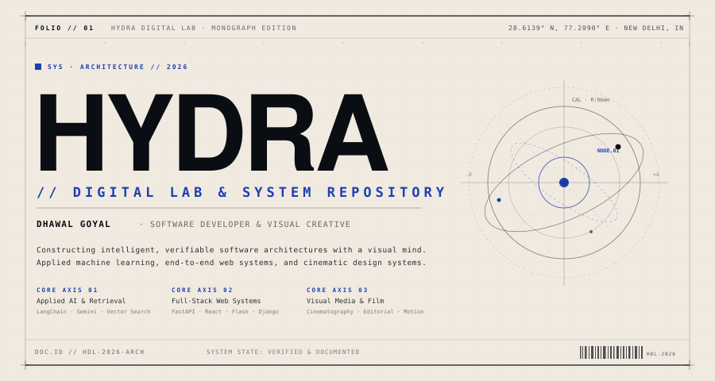
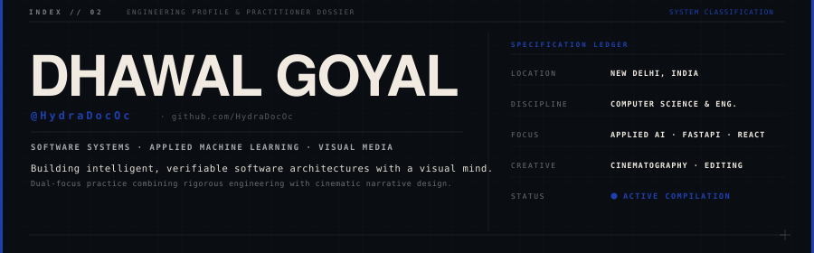
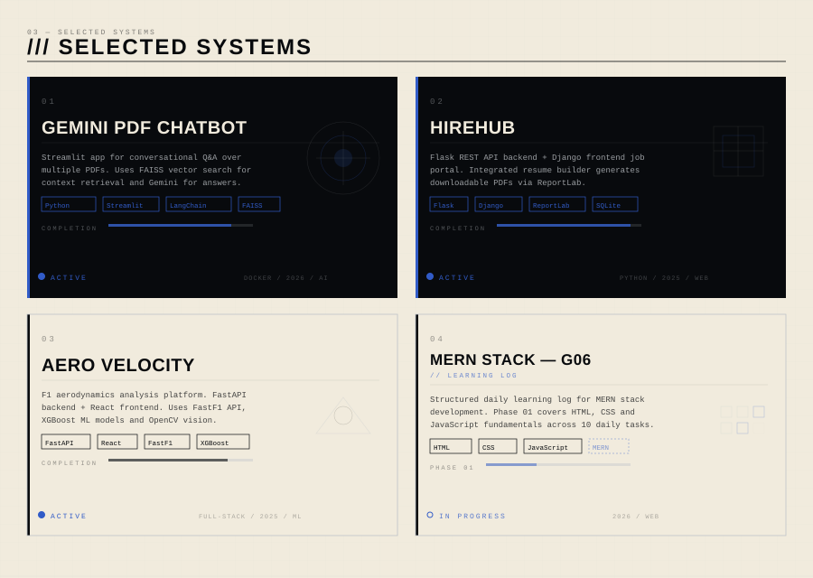
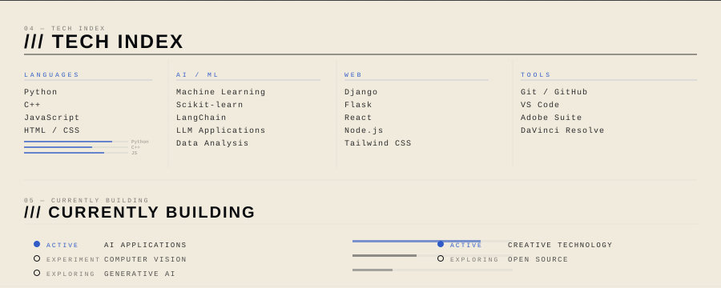
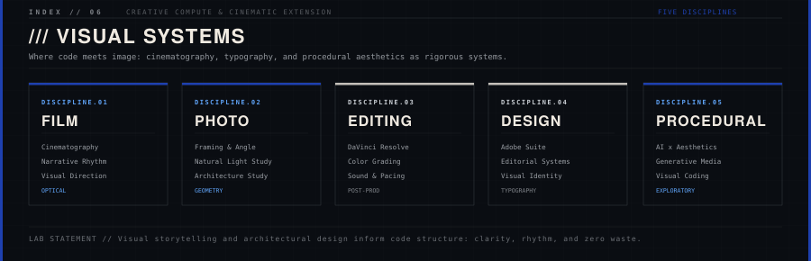

<!--
  HYDRA // DIGITAL LAB
  GitHub Profile — HydraDocOc
  Designed by: Dhawal Goyal
  Version: 1.0.0
  System: Neo-Futurist Editorial
-->

---

---

<table>
<tr>
<td align="center" width="225">

`01`&nbsp;&nbsp;**GEMINI PDF CHATBOT** 
[View Repository →](https://github.com/HydraDocOc/gemini-pdf-chatbot)

</td>
<td align="center" width="225">

`02`&nbsp;&nbsp;**HIREHUB** 
[View Repository →](https://github.com/HydraDocOc/HireHub-With-Resume-Builder-using-API)

</td>
<td align="center" width="225">

`03`&nbsp;&nbsp;**AERO VELOCITY** 
[View Repository →](https://github.com/HydraDocOc/Aero-Velocity)

</td>
<td align="center" width="225">

`04`&nbsp;&nbsp;**MERN STACK PROJECT** 
[View Repository →](https://github.com/HydraDocOc/MERN_STACK_G06)

</td>
</tr>
</table>

---

---

---

---

<code>HYDRA // DIGITAL LAB</code>&nbsp;&nbsp;·&nbsp;&nbsp;<a href="https://github.com/HydraDocOc">github.com/HydraDocOc</a>&nbsp;&nbsp;·&nbsp;&nbsp;<code>INDIA / 2026</code>

